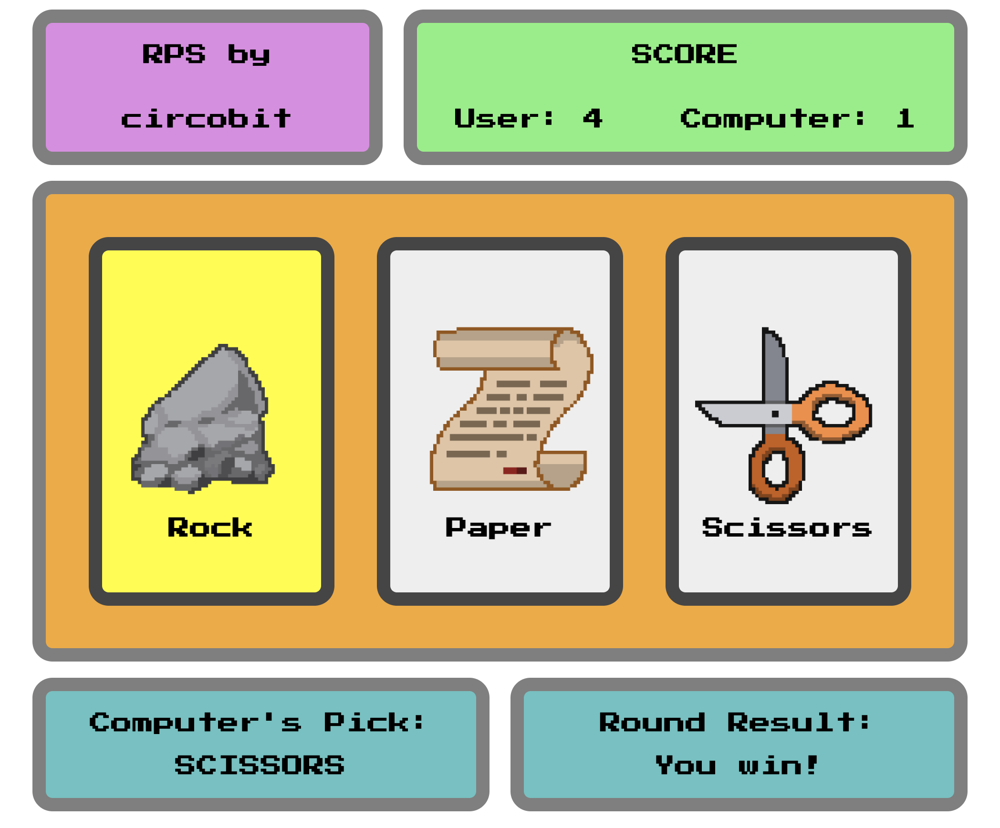

# Rock-Paper-Scissors

This project is part of the Foundations course from The Odin Project. The objective is to build the logic of the Rock-Paper-Scissors game with UI interface.

## Built with

- HTML
- CSS
- JavaScript

## Demo

[Try It Here](https://circobit-projects.github.io/rock-paper-scissors/)

## How to use

1. Open the `index.html` file in your browser.
2. Click on the object you want to pick (Rock, Paper or Scissors)
3. If you want to start the game from scratch, reload the page.

## Screenshots

