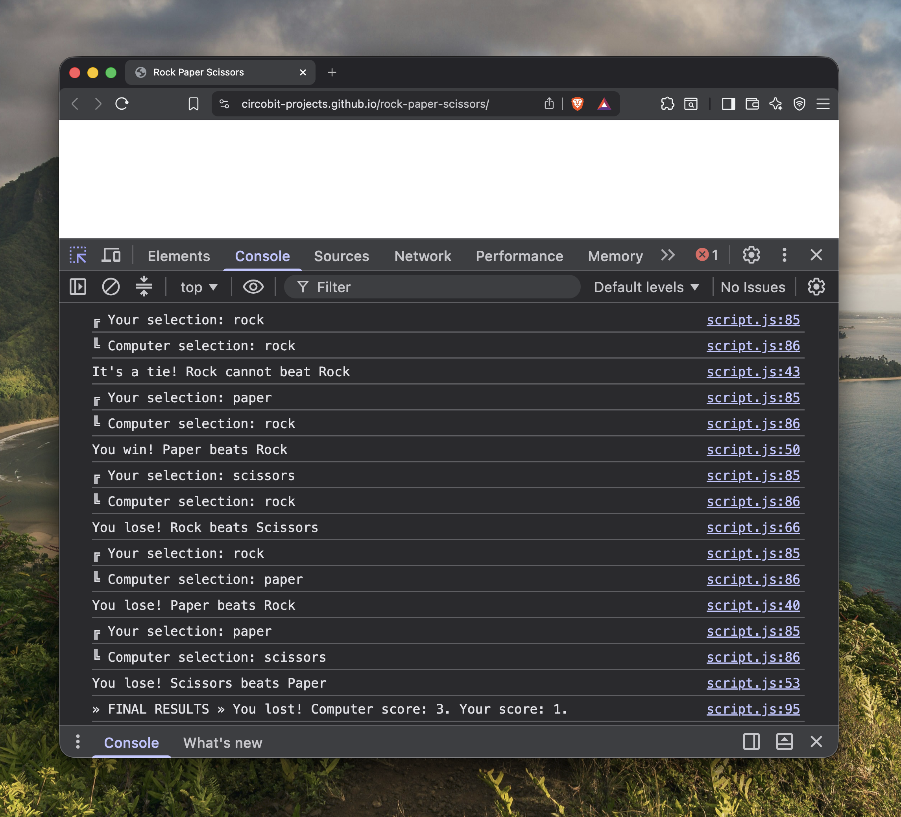

# Rock-Paper-Scissors

This project is part of the Foundations course from The Odin Project. The objective is to build the logic of the Rock-Paper-Scissors game in JavaScript to be ran in the console.

Duration: Each game consist of five rounds.

## Built with

- HTML
- JavaScript

## Demo

[Try It Here](https://circobit-projects.github.io/rock-paper-scissors/)

## How to use

1. Open the `index.html` file in your browser.
2. Open the console in your browser: 
    - Windows / Linux: `Ctrl + Shift + J` 
    - macOS: `Cmd + Option + J`
3. Type names of the objects as requested by the prompt

## Screenshots

